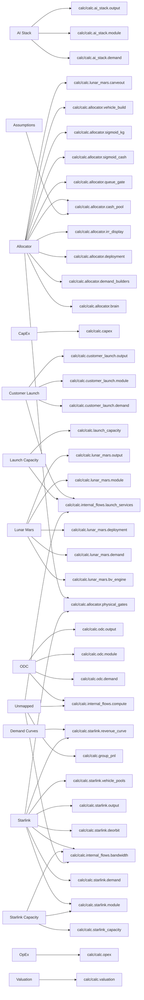

# Architecture Diagram

Auto-generated tab→package mapping per PRD §15.

```mermaid
flowchart LR
  AI_Stack["AI Stack"] --> calc_ai_stack_demand["calc/calc.ai_stack.demand"]
  AI_Stack["AI Stack"] --> calc_ai_stack_module["calc/calc.ai_stack.module"]
  AI_Stack["AI Stack"] --> calc_ai_stack_output["calc/calc.ai_stack.output"]
  Allocator["Allocator"] --> calc_allocator_brain["calc/calc.allocator.brain"]
  Allocator["Allocator"] --> calc_allocator_cash_pool["calc/calc.allocator.cash_pool"]
  Allocator["Allocator"] --> calc_allocator_demand_builders["calc/calc.allocator.demand_builders"]
  Allocator["Allocator"] --> calc_allocator_deployment["calc/calc.allocator.deployment"]
  Allocator["Allocator"] --> calc_allocator_irr_display["calc/calc.allocator.irr_display"]
  Allocator["Allocator"] --> calc_allocator_physical_gates["calc/calc.allocator.physical_gates"]
  Allocator["Allocator"] --> calc_allocator_queue_gate["calc/calc.allocator.queue_gate"]
  Allocator["Allocator"] --> calc_allocator_sigmoid_cash["calc/calc.allocator.sigmoid_cash"]
  Allocator["Allocator"] --> calc_allocator_sigmoid_kg["calc/calc.allocator.sigmoid_kg"]
  Allocator["Allocator"] --> calc_allocator_vehicle_build["calc/calc.allocator.vehicle_build"]
  Allocator["Allocator"] --> calc_lunar_mars_carveout["calc/calc.lunar_mars.carveout"]
  Assumptions["Assumptions"] --> calc_allocator_cash_pool["calc/calc.allocator.cash_pool"]
  CapEx["CapEx"] --> calc_capex["calc/calc.capex"]
  Customer_Launch["Customer Launch"] --> calc_customer_launch_demand["calc/calc.customer_launch.demand"]
  Customer_Launch["Customer Launch"] --> calc_customer_launch_module["calc/calc.customer_launch.module"]
  Customer_Launch["Customer Launch"] --> calc_customer_launch_output["calc/calc.customer_launch.output"]
  Customer_Launch["Customer Launch"] --> calc_internal_flows_launch_services["calc/calc.internal_flows.launch_services"]
  Demand_Curves["Demand Curves"] --> calc_starlink_revenue_curve["calc/calc.starlink.revenue_curve"]
  Launch_Capacity["Launch Capacity"] --> calc_internal_flows_launch_services["calc/calc.internal_flows.launch_services"]
  Launch_Capacity["Launch Capacity"] --> calc_launch_capacity["calc/calc.launch_capacity"]
  Lunar_Mars["Lunar Mars"] --> calc_lunar_mars_bv_engine["calc/calc.lunar_mars.bv_engine"]
  Lunar_Mars["Lunar Mars"] --> calc_lunar_mars_demand["calc/calc.lunar_mars.demand"]
  Lunar_Mars["Lunar Mars"] --> calc_lunar_mars_deployment["calc/calc.lunar_mars.deployment"]
  Lunar_Mars["Lunar Mars"] --> calc_lunar_mars_module["calc/calc.lunar_mars.module"]
  Lunar_Mars["Lunar Mars"] --> calc_lunar_mars_output["calc/calc.lunar_mars.output"]
  ODC["ODC"] --> calc_internal_flows_compute["calc/calc.internal_flows.compute"]
  ODC["ODC"] --> calc_odc_demand["calc/calc.odc.demand"]
  ODC["ODC"] --> calc_odc_module["calc/calc.odc.module"]
  ODC["ODC"] --> calc_odc_output["calc/calc.odc.output"]
  OpEx["OpEx"] --> calc_opex["calc/calc.opex"]
  Starlink["Starlink"] --> calc_allocator_physical_gates["calc/calc.allocator.physical_gates"]
  Starlink["Starlink"] --> calc_internal_flows_bandwidth["calc/calc.internal_flows.bandwidth"]
  Starlink["Starlink"] --> calc_starlink_demand["calc/calc.starlink.demand"]
  Starlink["Starlink"] --> calc_starlink_deorbit["calc/calc.starlink.deorbit"]
  Starlink["Starlink"] --> calc_starlink_module["calc/calc.starlink.module"]
  Starlink["Starlink"] --> calc_starlink_output["calc/calc.starlink.output"]
  Starlink["Starlink"] --> calc_starlink_revenue_curve["calc/calc.starlink.revenue_curve"]
  Starlink["Starlink"] --> calc_starlink_vehicle_pools["calc/calc.starlink.vehicle_pools"]
  Starlink_Capacity["Starlink Capacity"] --> calc_internal_flows_bandwidth["calc/calc.internal_flows.bandwidth"]
  Starlink_Capacity["Starlink Capacity"] --> calc_starlink_module["calc/calc.starlink.module"]
  Starlink_Capacity["Starlink Capacity"] --> calc_starlink_capacity["calc/calc.starlink_capacity"]
  Unmapped["Unmapped"] --> calc_group_pnl["calc/calc.group_pnl"]
  Unmapped["Unmapped"] --> calc_internal_flows_bandwidth["calc/calc.internal_flows.bandwidth"]
  Unmapped["Unmapped"] --> calc_internal_flows_compute["calc/calc.internal_flows.compute"]
  Unmapped["Unmapped"] --> calc_internal_flows_launch_services["calc/calc.internal_flows.launch_services"]
  Valuation["Valuation"] --> calc_valuation["calc/calc.valuation"]
```
